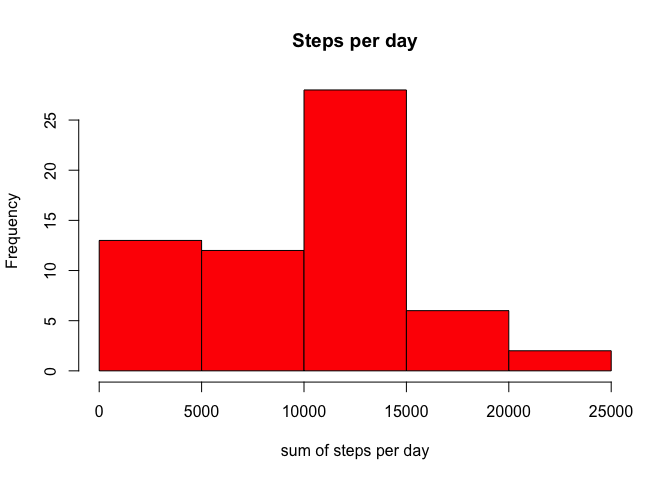
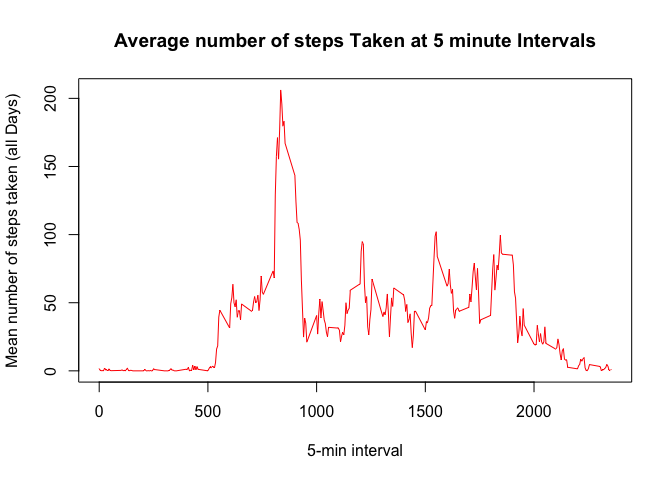
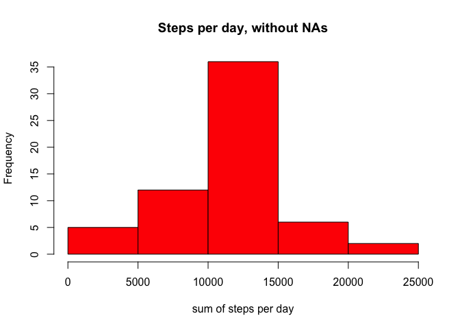
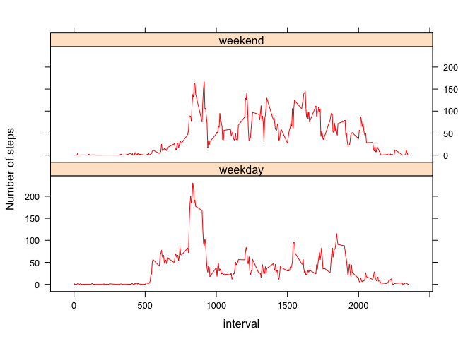

# Coursera-reproducible-research-CW1
Kasya Shahovskaya  
04/12/2016  
ps. All process was done on Mac systm.

___________________________________

####1.Loading and preprocessing the data 
*Reading data and getting its summary:*


```r
data <- read.csv("/Users/kasya/Documents/GHW/01/RepData_PeerAssessment1/activity.csv", header=TRUE)   
summary(data) 
```

```
##      steps                date          interval     
##  Min.   :  0.00   2012-10-01:  288   Min.   :   0.0  
##  1st Qu.:  0.00   2012-10-02:  288   1st Qu.: 588.8  
##  Median :  0.00   2012-10-03:  288   Median :1177.5  
##  Mean   : 37.38   2012-10-04:  288   Mean   :1177.5  
##  3rd Qu.: 12.00   2012-10-05:  288   3rd Qu.:1766.2  
##  Max.   :806.00   2012-10-06:  288   Max.   :2355.0  
##  NA's   :2304     (Other)   :15840
```
___________________________________
####2.What is mean total number of steps taken per day? 

2.a. Total number of steps taken per day 

```r
summofsteps <- tapply(data$steps, data$date, sum, na.rm=T)
```

2.b. Make a histogram of the total number of steps taken each day

```r
hist(summofsteps, xlab = "sum of steps per day", main = "Steps per day", col = "red")
```

<!-- -->

  2.c.Calculate and report the mean and median of the total number of steps taken per day   


```r
mean_summofsteps <- round(mean(summofsteps))
median_summofsteps <- round(median(summofsteps))
print(c("Mean is", mean_summofsteps))
```

```
## [1] "Mean is" "9354"
```

```r
print(c("The median is",median_summofsteps))
```

```
## [1] "The median is" "10395"
```
___________________________________
####3.What is the average daily activity pattern? 

3.a.Make a time series plot (i.e. 𝚝𝚢𝚙𝚎 = "𝚕") of the 5-minute interval (x-axis) and the average number of steps taken, averaged across all days (y-axis)

```r
minutes_interval <- tapply(data$steps, data$interval, mean, na.rm=T)
plot(minutes_interval ~ unique(data$interval), type="l", xlab = "5-min interval", ylab = "Mean number of steps taken (all Days)", main = "Average number of steps Taken at 5 minute Intervals", col = "red")
```

<!-- -->

3.b.Which 5-minute interval, on average across all the days in the dataset, contains the maximum number of steps?

```r
minutes_interval[which.max(minutes_interval)]
```

```
##      835 
## 206.1698
```
Means 835 interval contains the maximum number of steps.

___________________________________
  
#### 4. Imputing missing values

4.a. Calculate and report the total number of missing values in the dataset (i.e. the total number of rows with 𝙽𝙰s)

```r
sum(is.na(data$steps))
```

```
## [1] 2304
```

4.b. Devise a strategy for filling in all of the missing values in the dataset.Create a new dataset that is equal to the original dataset but with the missing data filled in.

*I will use the mean for that 5-minute interval to replace NA in this interval*


```r
newdata <- data  # new dataset without NA
for (i in 1:nrow(data)){
    if(is.na(data$steps[i])){
       newdata$steps[i]<- minutes_interval[[as.character(data[i, "interval"])]]
    }
}
summary(newdata)
```

```
##      steps                date          interval     
##  Min.   :  0.00   2012-10-01:  288   Min.   :   0.0  
##  1st Qu.:  0.00   2012-10-02:  288   1st Qu.: 588.8  
##  Median :  0.00   2012-10-03:  288   Median :1177.5  
##  Mean   : 37.38   2012-10-04:  288   Mean   :1177.5  
##  3rd Qu.: 27.00   2012-10-05:  288   3rd Qu.:1766.2  
##  Max.   :806.00   2012-10-06:  288   Max.   :2355.0  
##                   (Other)   :15840
```

4.d. Make a histogram of the total number of steps taken each day.

```r
data22 <- tapply(newdata$steps, newdata$date, sum, na.rm=T)
hist(data22, xlab = "sum of steps per day", main = "Steps per day, without NAs", col="red")
```

<!-- -->

4.e. Calculate and report the mean and median total number of steps taken per day. 


```r
mean_data22 <- round(mean(data22))
median_data22 <- round(median(data22))
```

New values are:


```r
print(c("The mean is", mean_data22))
```

```
## [1] "The mean is" "10766"
```

```r
print(c("The median is", median_data22))
```

```
## [1] "The median is" "10766"
```

*Do these values differ from the estimates from the first part of the assignment?*
Let's compare values: 

```r
dfsumm <- rbind(data.frame(mean = c(mean_summofsteps, mean_data22), median = c(median_summofsteps, median_data22)))
rownames(dfsumm) <- c("with NA's", "without NA's")
print(dfsumm)
```

```
##               mean median
## with NA's     9354  10395
## without NA's 10766  10766
```


*What is the impact of imputing missing data on the estimates of the total daily number of steps?*
The mean value and the median value are different since we imputed missing values.


___________________________________
  
  
#### 5.Are there differences in activity patterns between weekdays and weekends?
Use the dataset with the filled-in missing values for this part.

*I expect different patterns coz people have different activities on weekends.*

5.a. Create a new factor variable in the dataset with two levels – “weekday” and “weekend” indicating whether a given date is a weekday or weekend day.


```r
newdata$weekday <- c("weekday")
newdata[weekdays(as.Date(newdata[, 2])) %in% c("Saturday", "Sunday"), ][4] <- c("weekend")
table(newdata$weekday == "weekend")
```

```
## 
## FALSE  TRUE 
## 12960  4608
```

```r
newdata$weekday <- factor(newdata$weekday)
```
*Creating new dataframe, then use lattice package to make a plot*


```r
newdata_weekend <-subset(newdata, newdata$weekday=="weekend")
newdata_weekday <-subset(newdata, newdata$weekday=="weekday")
mean_newdata_weekday<-tapply(newdata_weekday$steps, newdata_weekday$interval,mean)
mean_newdata_weekend<-tapply(newdata_weekend$steps, newdata_weekend$interval,mean)
library(lattice)
DF_weekday <- NULL
DF_weekend <- NULL
DF_final <- NULL
DF_weekday <- data.frame(interval = unique(newdata_weekday$interval), avg = as.numeric(mean_newdata_weekday), day = rep("weekday", length(mean_newdata_weekday)))
DF_weekend <- data.frame(interval = unique(newdata_weekend$interval),avg = as.numeric(mean_newdata_weekend), day = rep("weekend", length(mean_newdata_weekend)))
DF_final <- rbind(DF_weekday, DF_weekend)
xyplot(avg ~ interval | day, data = DF_final, layout = c(1, 2), 
       type = "l", ylab = "Number of steps", col="red")
```

<!-- -->

  *We see a difference in graps. Mornings are less active during weekends, but daytime are more active period than on a typical weekday.*


